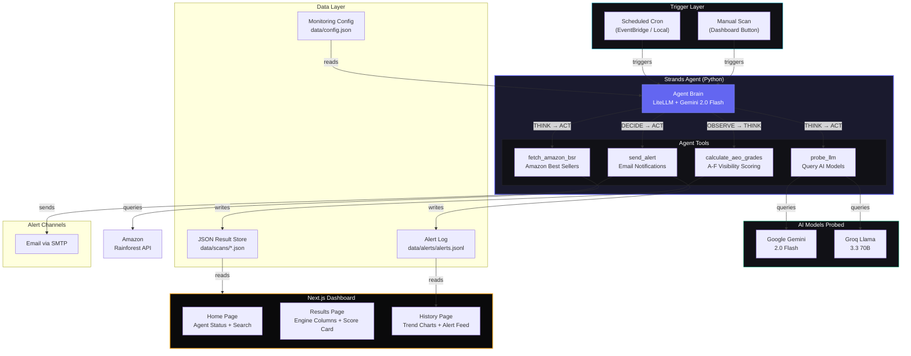
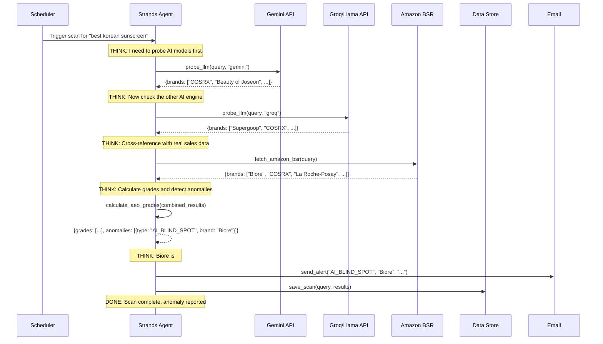

# Pixii Sentinel — Architecture

## System Architecture Diagram



## Agent Execution Flow (ReAct Loop)



## Data Flow

```
Input:  Monitored shopping queries (from config.json)
  │
  ▼
Agent probes AI models + Amazon simultaneously
  │
  ▼
Results compared and graded (A–F visibility score)
  │
  ├── Normal results → Saved silently to data/scans/
  │
  └── Anomaly detected → Alert sent via email
                        → Saved to data/alerts/
                        → Visible on dashboard
```

## Tech Stack

| Layer | Technology | Purpose |
|:------|:-----------|:--------|
| Agent Framework | Strands Agents SDK | Autonomous tool-calling agent loop |
| Agent LLM | Google Gemini 2.0 Flash (via LiteLLM) | Agent reasoning and decision-making |
| Probed AI Models | Gemini + Groq Llama 3.3 | Brand recommendation extraction |
| Market Data | Rainforest API (Amazon) | Real-world BSR cross-reference |
| Dashboard | Next.js 16 + Tailwind CSS | Premium analytics UI |
| Alerting | SMTP Email | Human notification on anomalies |
| Data Store | JSON files | Scan results + alert history |
| Deployment | Vercel (Dashboard) + Local/AWS (Agent) | Production hosting |
