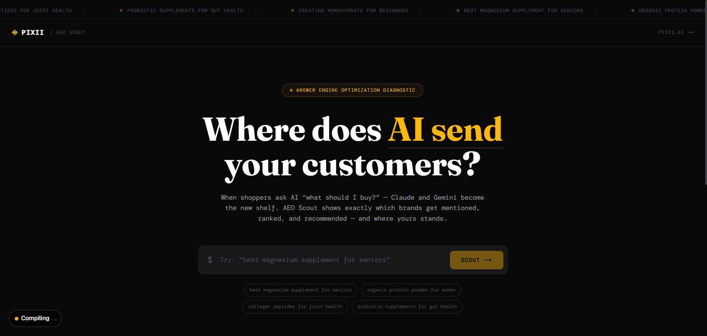
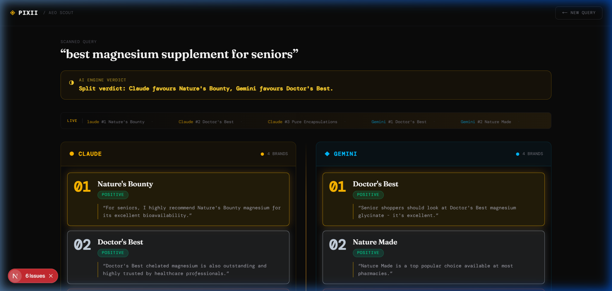

# Pixii AEO Scout

> **Where does AI send your customers?**

[](https://vercel.com/new/clone?repository-url=https://github.com/YOUR_USERNAME/pixii-aeo-scout&env=ANTHROPIC_API_KEY,GOOGLE_API_KEY&envDescription=API%20keys%20for%20Claude%20and%20Gemini&envLink=https://github.com/YOUR_USERNAME/pixii-aeo-scout%23environment-variables)

## What is AEO?

**Answer Engine Optimization (AEO)** is the practice of ensuring your brand gets mentioned — and mentioned favourably — when AI assistants like Claude and Gemini answer shopping queries. As more customers ask AI "what should I buy?", your shelf space is no longer physical or even digital — it's the AI's response.

**Pixii AEO Scout** scans both Claude and Gemini simultaneously for your product category, extracts every brand mention, ranks them by order of appearance, scores sentiment, and produces a combined A–F grade card — all in under 10 seconds.

---

## Features

- 🔍 **Dual-engine scanning** — Claude (Anthropic) + Gemini (Google) queried in parallel
- 📊 **Ranked brand mentions** — gold/silver/bronze position badges
- 💬 **Sentiment analysis** — Positive / Neutral / Mentioned Briefly
- ⭐ **Combined score card** — A–F grade across both engines
- ⚡ **Live loading sequence** — step-by-step diagnostic animation
- 📱 **Mobile responsive** — columns stack on small screens

---

## Screenshots

**Landing page**


**Results report card**


---

## Environment Variables

| Variable | Description | Where to get it |
|---|---|---|
| `ANTHROPIC_API_KEY` | Claude API key | [console.anthropic.com](https://console.anthropic.com/) |
| `GOOGLE_API_KEY` | Gemini API key | [aistudio.google.com](https://aistudio.google.com/app/apikey) |

### Adding to Vercel

1. Go to your Vercel project → **Settings** → **Environment Variables**
2. Add `ANTHROPIC_API_KEY` and `GOOGLE_API_KEY`
3. Redeploy

### Local development

```bash
cp .env.example .env.local
# Fill in your keys in .env.local
npm run dev
```

---

## Tech Stack

- **Next.js 16** App Router — single repo, single Vercel deploy
- **TypeScript** — full type safety end-to-end
- **Tailwind CSS v4** — utility-first styling
- **`@anthropic-ai/sdk`** — official Anthropic SDK (server-side only)
- **`@google/generative-ai`** — official Google AI SDK (server-side only)
- **No database, no auth, no backend infrastructure**

---

## Project Structure

```
/app
  page.tsx              ← Landing page + query input
  /results/page.tsx     ← Report card
  /api/query/route.ts   ← Calls Claude + Gemini, returns JSON
/components
  EngineColumn.tsx      ← Per-engine results column
  BrandBadge.tsx        ← Individual brand mention card
  ScoreCard.tsx         ← Combined A-F grade table
  LoadingSequence.tsx   ← Step-by-step loading animation
/lib
  parseResponse.ts      ← Brand extraction + sentiment logic
```

---

## How the Parsing Works

`/lib/parseResponse.ts` uses a layered regex approach to handle messy LLM output:

1. **Numbered list patterns** — catches `1. BrandName`
2. **Bulleted list patterns** — catches `- BrandName`, `• BrandName`
3. **Markdown bold** — catches `**BrandName**`
4. **Quoted strings** — catches `"BrandName"`
5. **Title-cased phrases** — catches mid-sentence brand mentions

Each candidate is filtered through a stop-word list (~80 common English words) before being accepted as a brand. Sentiment is determined by scanning the surrounding sentence for positive/negative signal words.

---

## One-Click Deploy

[](https://vercel.com/new/clone?repository-url=https://github.com/YOUR_USERNAME/pixii-aeo-scout&env=ANTHROPIC_API_KEY,GOOGLE_API_KEY)

Built for [Pixii](https://pixii.ai) — AI design tools for Amazon sellers.
